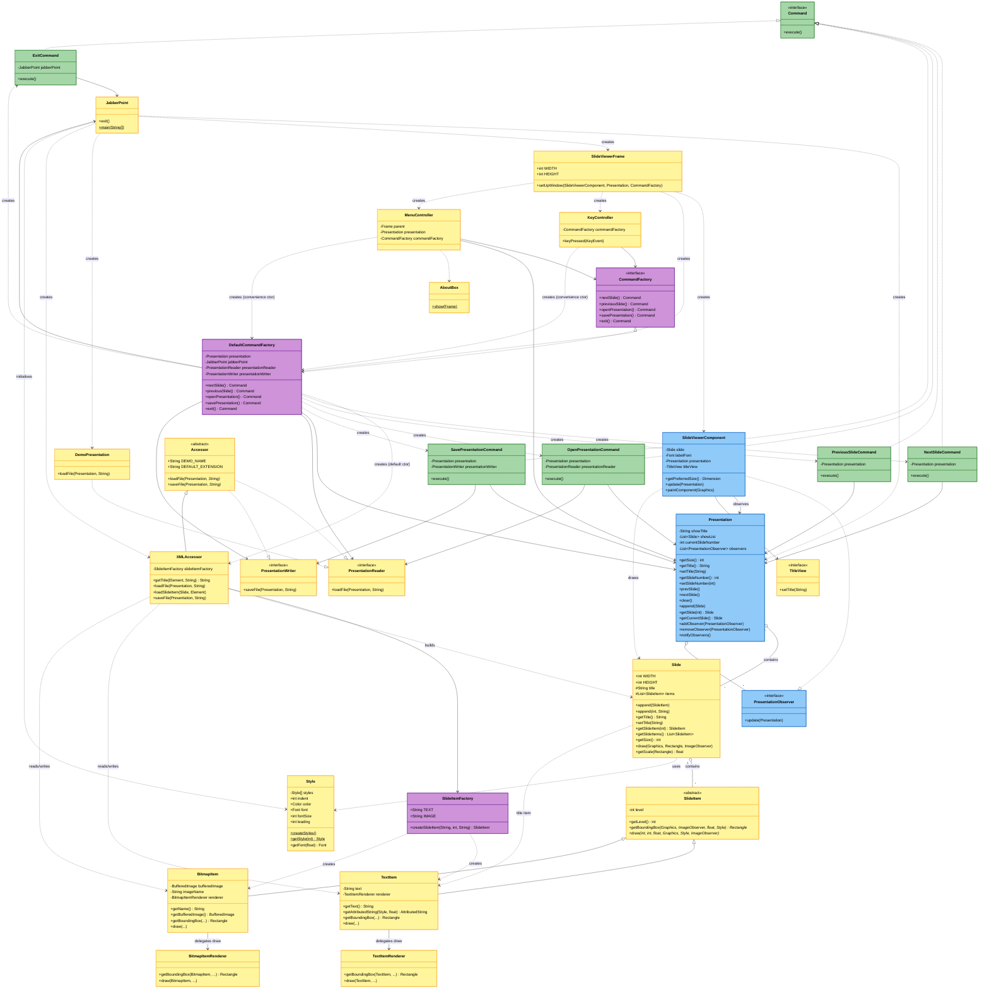

# JabberPoint Class Diagram

UML class diagram of the JabberPoint system, grouped by package. Renders in any
Mermaid-aware Markdown viewer (GitHub, IntelliJ, VS Code).

## Overview

The system applies several design patterns:

- **Command** (`command` package): UI controllers trigger actions via `Command` objects supplied by a `CommandFactory`.
- **Abstract Factory / DIP**: `CommandFactory` and `SlideItemFactory` decouple clients from concrete construction.
- **Observer**: `Presentation` notifies `PresentationObserver`s (the `SlideViewerComponent`) of state changes.
- **Strategy / Bridge**: `SlideItem` subclasses delegate drawing to dedicated renderer classes.
- **Template (Accessor)**: `Accessor` unifies read/write of presentations; `XMLAccessor` implements XML I/O.

## Diagram

## Design pattern legend

| Color | Pattern | Classes |
|-------|---------|---------|
| Blue | Observer | `Presentation` (subject), `PresentationObserver`, `SlideViewerComponent` |
| Green | Command | `Command`, `NextSlideCommand`, `PreviousSlideCommand`, `OpenPresentationCommand`, `SavePresentationCommand`, `ExitCommand` |
| Purple | Factory Method | `CommandFactory`, `DefaultCommandFactory`, `SlideItemFactory` |
| Yellow | Non-Pattern | All remaining domain, I/O, UI and rendering classes |

## Package legend

- **`jabberpoint`**: `JabberPoint` (entry point).
- **`jabberpoint.core`**: domain model + rendering (`Presentation`, `Slide`, `SlideItem` and subclasses, renderers, `Style`, `SlideItemFactory`, `PresentationObserver`).
- **`jabberpoint.command`**: `Command`, `CommandFactory`, `DefaultCommandFactory`, and concrete commands.
- **`jabberpoint.io`**: `PresentationReader`/`PresentationWriter` interfaces, `Accessor`, `XMLAccessor`, `DemoPresentation`.
- **`jabberpoint.ui`**: Swing frame/component and controllers (`SlideViewerFrame`, `SlideViewerComponent`, `MenuController`, `KeyController`, `TitleView`, `AboutBox`).
